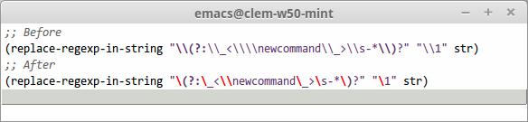
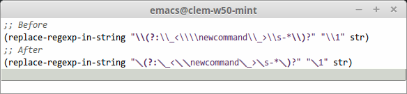

# `easy-escape`


`easy-escape-minor-mode` composes double backslashes (escape characters) into single backslashes, and highlights them to improve readability. The underlying buffer text is not modified.

The default is to use a single \ character instead of two, but the character used and its color can be customized using `easy-escape-face` and `easy-escape-character`.

## Screenshots

### Using a custom color



### Using a custom character



## Setup

### MELPA (preferred)

This will be valid if the package gets accepted on MELPA:

1. Setup [MELPA](http://melpa.org/#/getting-started) if you haven't yet

    In your `.emacs`, add these three lines:

    ```elisp
    (require 'package)
    (add-to-list 'package-archives '("melpa" . "http://melpa.org/packages/") t)
    (package-initialize)
    ```

2. Install the package: `M-x package-install RET easy-mode RET`

3. Enable `easy-escape-minor-mode` in lisp buffers:

    ```elisp
    ;; Replace 'lisp-mode-hook with 'prog-mode-hook to enable everywhere
    (add-hook 'lisp-mode-hook 'easy-escape-minor-mode)
    ```

### Alternative setup

1. Download [this file](https://raw.githubusercontent.com/cpitclaudel/easy-escape/master/easy-escape.el)

2. Add this to your .emacs:

    ```elisp
    (load-file "PATH-TO-THE-FILE-YOU-JUST-DOWNLOADED")
    (add-hook 'lisp-mode-hook 'easy-escape-minor-mode)
    ```

## Fine-tuning

* If you find the distinction between the fontified double-slash and the
single slash too subtle, try the following:

    * Adjust the foreground of `easy-escape-face`:

        ```elisp
        (set-face-attribute 'easy-escape-face nil :foreground "red")
        ```

    * Set `easy-escape-character` to a different character:

        ```elisp
        (setq easy-escape-character ?╲)
        ```
